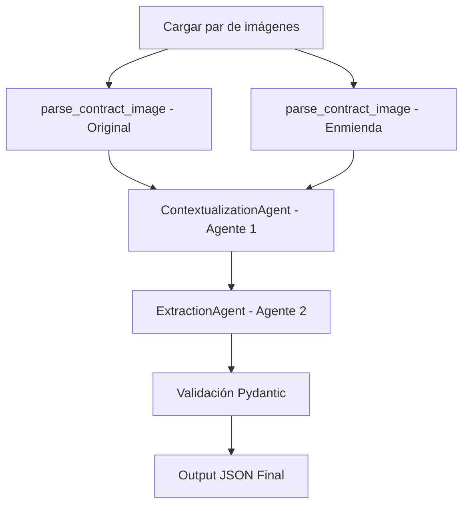

# Plan de Implementación: Sistema Multi-Agente LegalMove

## Descripción General

Construir un **Agente Autónomo de Comparación de Contratos** para la empresa ficticia LegalMove. El sistema recibe pares de imágenes escaneadas (contrato original + enmienda), extrae el texto mediante GPT-4o Vision, y lo procesa con dos agentes especializados para identificar y estructurar los cambios legales, entregando un JSON validado por Pydantic con trazabilidad completa en Langfuse.

---

## Estructura del Repositorio a Crear

```
HENRY_TPM4/
├── src/
│   ├── __init__.py
│   ├── main.py                          # Orquestador principal del pipeline
│   ├── models.py                        # Esquemas Pydantic
│   ├── image_parser.py                  # Encoding base64 + GPT-4o Vision API
│   └── agents/
│       ├── __init__.py
│       ├── contextualization_agent.py   # Agente 1 - El Auditor
│       └── extraction_agent.py          # Agente 2 - El Analista
├── data/
│   └── test_contracts/                  # 3 pares de imágenes (ya disponibles en Doc_base)
│       ├── documento_1__original.jpg
│       ├── documento_1__enmienda.jpg
│       ├── documento_2__original.jpg
│       ├── documento_2__enmienda.jpg
│       ├── documento_3__original.jpg
│       └── documento_3__enmienda.jpg
├── requirements.txt
├── .env.example
└── README.md
```

> [!NOTE]
> Las 6 imágenes de prueba ya existen en `Doc_base/Imágenes de ejemplo/`. Se copiarán a `data/test_contracts/` como parte del setup inicial.

---

## Módulos a Implementar

### 1. `src/models.py` — Esquemas Pydantic

**Propósito:** Definir el contrato de datos de salida con validación estricta.

Contendrá el modelo `ContractChangeOutput` con los campos requeridos por la consigna:

| Campo | Tipo | Descripción |
|-------|------|-------------|
| `sections_changed` | `List[str]` | Identificadores de las secciones modificadas |
| `topics_touched` | `List[str]` | Categorías legales/comerciales afectadas |
| `summary_of_the_change` | `str` | Descripción narrativa detallada del cambio |
| `clause_affected` | `str` | Nombre/número de la cláusula específica |
| `original_text` | `str` | Texto original de la cláusula |
| `modified_text` | `str` | Texto modificado de la cláusula |
| `change_type` | `Literal["Suma", "Resta", "Modificación"]` | Tipo de cambio aplicado |
| `legal_impact_level` | `Literal["Alto", "Medio", "Bajo"]` | Nivel de impacto legal estimado |

Se creará también un modelo contenedor `ContractAnalysisResult` que agrupe una lista de `ContractChangeOutput` para soportar múltiples cambios por análisis.

---

### 2. `src/image_parser.py` — Parsing Multimodal

**Propósito:** Encapsular toda la lógica de interacción con GPT-4o Vision.

**Funciones a implementar:**

- `encode_image_to_base64(image_path: str) -> str`: Codifica una imagen local en base64.
- `parse_contract_image(image_path: str, langfuse_trace=None) -> str`: Llama a la API de GPT-4o Vision con un prompt especializado para extraer texto preservando la jerarquía (numeración de cláusulas, secciones, párrafos). Registra el span en Langfuse con inputs, outputs y latencia.

**System Prompt de Vision:** Instruirá al modelo para actuar como un OCR legal de alta precisión, preservando la estructura jerárquica del documento (números de sección, sangrías, formato de tablas si las hubiera).

---

### 3. `src/agents/contextualization_agent.py` — Agente 1: El Auditor

**Propósito:** Recibir los dos textos parseados y construir un mapa estructurado de correspondencias, SIN extraer cambios todavía.

**System Prompt (Few-Shot con rol definido):**
> Eres un Auditor Legal Senior con 20 años de experiencia en derecho contractual. Tu ÚNICA tarea en este paso es construir un mapa de correspondencia estructural entre el contrato original y su enmienda. Identifica qué sección del original corresponde a qué sección de la enmienda y describe el propósito de cada bloque. NO identifiques cambios aún, solo mapea la estructura.

**Técnica de prompting:** Chain-of-Thought con delimitadores `<ORIGINAL>`, `<ENMIENDA>` para separar los textos de entrada.

**Output:** Texto estructurado (markdown con secciones numeradas) listo para pasarse al Agente 2.

---

### 4. `src/agents/extraction_agent.py` — Agente 2: El Analista

**Propósito:** Recibir el mapa contextual y los textos originales para identificar, aislar y describir cada cambio, estructurándolos en el formato Pydantic.

**System Prompt (Few-Shot con ejemplos concretos):**
> Eres un Especialista en Compliance Legal. Recibirás un mapa contextual de un contrato y su enmienda. Tu tarea es identificar EXACTAMENTE qué cambió en cada cláusula, clasificar el tipo de cambio (Suma/Resta/Modificación) y evaluar el impacto legal (Alto/Medio/Bajo). Debes responder EXCLUSIVAMENTE en formato JSON válido, siguiendo el esquema proporcionado.

**Few-Shot Example embebido en el prompt** para guiar el formato de salida JSON.

**Output:** JSON estructurado que será validado por `ContractChangeOutput`.

---

### 5. `src/main.py` — Orquestador del Pipeline

**Propósito:** Coordinar la ejecución completa del pipeline con trazabilidad en Langfuse.

**Pipeline de ejecución:**



**Jerarquía de trazas Langfuse:**
```
trace: contract-analysis
  ├── span: parse_original_contract
  ├── span: parse_amendment_contract
  ├── span: contextualization_agent
  └── span: extraction_agent
```

**Función principal:** `run_contract_analysis(original_path, amendment_path) -> ContractAnalysisResult`

---

### 6. `requirements.txt` y `.env.example`

**Dependencias con versiones fijas:**
```
langchain==0.3.x
langchain-openai==0.3.x
openai==1.x.x
pydantic==2.x.x
langfuse==2.x.x
python-dotenv==1.0.x
```

**Variables de entorno requeridas:**
```
OPENAI_API_KEY=

# Langfuse
LANGFUSE_PUBLIC_KEY=
LANGFUSE_SECRET_KEY=
LANGFUSE_HOST=https://cloud.langfuse.com

# Modelos (permite cambiar sin tocar código)
LLM_MODEL=gpt-4o
VISION_MODEL=gpt-4o
```

Consumidas en código con fallback explícito:
```python
LLM_MODEL    = os.getenv("LLM_MODEL", "gpt-4o")
VISION_MODEL = os.getenv("VISION_MODEL", "gpt-4o")
```

> **Nota:** Separar `LLM_MODEL` y `VISION_MODEL` permite, por ejemplo, usar `gpt-4o-mini` para los agentes de texto (más económico) y mantener `gpt-4o` solo para el parsing visual de alta precisión.

---

### 7. `README.md`

Documentará:
- Descripción del proyecto y arquitectura
- Diagrama del pipeline de agentes
- Instrucciones de instalación y configuración
- Cómo ejecutar el pipeline con los contratos de prueba
- Interpretación del output JSON

---

## Secuencia de Codificación

El código se generará en este orden para respetar las dependencias entre módulos:

| Paso | Archivo | Motivo |
|------|---------|--------|
| 1 | `src/models.py` | Base de todos los tipos de datos |
| 2 | `src/image_parser.py` | Dependencia de `main.py` |
| 3 | `src/agents/contextualization_agent.py` | Agente 1, consumido por `main.py` |
| 4 | `src/agents/extraction_agent.py` | Agente 2, depende del output de Agente 1 |
| 5 | `src/main.py` | Orquesta todo lo anterior |
| 6 | `requirements.txt` + `.env.example` | Configuración del entorno |
| 7 | `README.md` | Documentación final |
| 8 | Setup de `data/test_contracts/` | Copiar imágenes de `Doc_base/` |

---

## Estrategia de Calidad

- **Principios SOLID:** Cada módulo tiene una responsabilidad única y bien definida.
- **Manejo de errores:** `try-except` en todas las llamadas a la API (Vision, LLM, Pydantic validation). Errores logeados en el span de Langfuse antes de relanzar.
- **Prompting:** Few-Shot con delimitadores XML-style (`<ORIGINAL>`, `<ENMIENDA>`, `<CONTEXTO>`) + Chain-of-Thought explícito en el Agente 1.
- **Validación estricta:** `model_validate()` de Pydantic v2 con `model_config = ConfigDict(strict=True)`.

---

## Plan de Verificación

### Pruebas automatizadas
- Ejecutar `python src/main.py` con los 3 pares de imágenes de prueba.
- Verificar que el output sea un JSON válido conforme al esquema `ContractAnalysisResult`.
- Comprobar en `cloud.langfuse.com` que la jerarquía de spans se registra correctamente.

### Verificación manual
- Revisar que los `sections_changed` y `topics_touched` identificados correspondan a las diferencias documentadas en `Diferencias entre Contratos y Enmiendas de ejemplo.docx`.
- Confirmar que el `legal_impact_level` es coherente con el tipo de cambio detectado.
